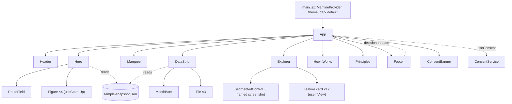

# Component hierarchy

```mermaid
flowchart TD
    main[main.jsx: MantineProvider, theme, dark default] --> App
    App --> Header
    App --> Hero --> RouteField
    Hero --> Figure["Figure ×4 (useCountUp)"]
    App --> Marquee
    App --> DataStrip --> MonthBars
    DataStrip --> Tile["Tile ×3"]
    App --> Explorer --> Shots[SegmentedControl + framed screenshot]
    Explorer --> Cards["Feature card ×12 (useInView)"]
    App --> HowItWorks
    App --> Principles
    App --> Footer
    App --> ConsentBanner
    App -. useConsent .-> ConsentService
    Footer -. decision, reopen .-> App
    Hero & DataStrip -. reads .-> Snapshot[(sample-snapshot.json)]
```
