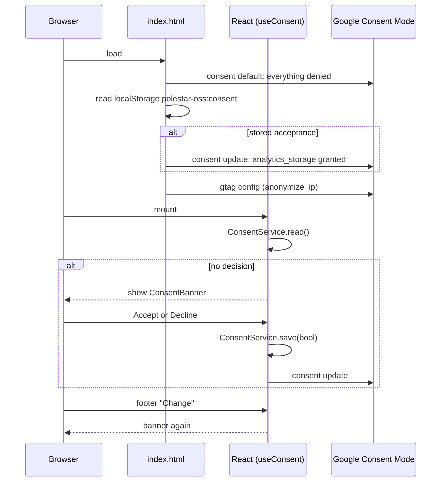

# Consent flow

```mermaid
sequenceDiagram
    participant B as Browser
    participant H as index.html
    participant R as React (useConsent)
    participant G as Google Consent Mode
    B->>H: load
    H->>G: consent default: everything denied
    H->>H: read localStorage polestar-oss:consent
    alt stored acceptance
        H->>G: consent update: analytics_storage granted
    end
    H->>G: gtag config (anonymize_ip)
    B->>R: mount
    R->>R: ConsentService.read()
    alt no decision
        R-->>B: show ConsentBanner
        B->>R: Accept or Decline
        R->>R: ConsentService.save(bool)
        R->>G: consent update
    end
    B->>R: footer "Change"
    R-->>B: banner again
```
