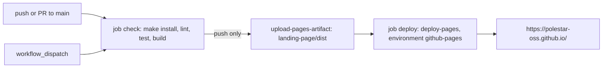

# Deployment

```mermaid
flowchart LR
    push[push or PR to main] --> check[job check: make install, lint, test, build]
    check -->|push only| art[upload-pages-artifact: landing-page/dist]
    art --> deploy[job deploy: deploy-pages, environment github-pages]
    deploy --> site[https://polestar-oss.github.io/]
    dispatch[workflow_dispatch] --> check
```

The explorer is deployed by its own repository to
`https://polestar-oss.github.io/polestar-journey-log-explorer/`; this workflow does not
touch it.
